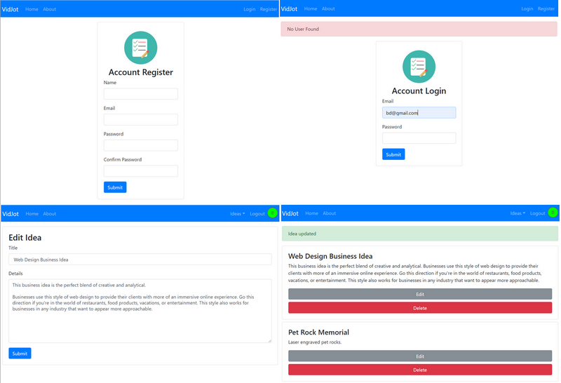

# Jot ideas - Track and list your creative ideas.

> ## Run Application
>
> > [[Here]](https://fierce-depths-94382.herokuapp.com/)

## Resources

- [Mongo DB](https://github.com/ericf/express-handlebars)
- [Express](https://expressjs.com/en/guide/using-middleware.html)
- [Handle Bars](https://github.com/ericf/express-handlebars)
- [Node.JS](https://nodejs.org/en/)

- [Body Parser](https://github.com/expressjs/body-parser)
- [Method Override](https://github.com/expressjs/method-override)

- [Express Session](https://www.npmjs.com/package/express-session)
- [Express Messages](https://www.npmjs.com/package/express-messages)
- [Express Flash](https://www.npmjs.com/package/express-flash)
- [Passport JS](http://www.passportjs.org/)
- [bcrypt JS](https://www.npmjs.com/package/bcryptjs)

### Setup

> npm init
> answer questions
> entry point: app.js

- setup Mongo & Mongoose
  > npm install --save mongoose

-Express install and add to package.json

> npm install --save express

- nodemon to handle auto-restarts
  npm install -g nodemon

- Path to global modules

  > npm root -g

#### middleware

- handle bars
- handlebarsjs.com
- expressjs
- express handle bars

  > npm install express-handlebars --save

#### Module to map input data to req.body

- body parser
- Parse incoming request bodies in a middleware before your handlers, available under the req.body property

  > npm install --save body-parser

#### Module to help override post to put

- Edit should be a put request, cannot do a put with a form - transform post <-> put
- method-override

  > npm install --save method-override

#### Flash is express-session - authentication, toaster events

- express-session
- express-messages
- express-flash

  > npm install --save express-session
  > npm install --save connect-flash

#### Passport - Local User Authentication

> npm install --save passport
> npm install --save passport-local

#### install encryption for password

> npm install --save bcryptjs
